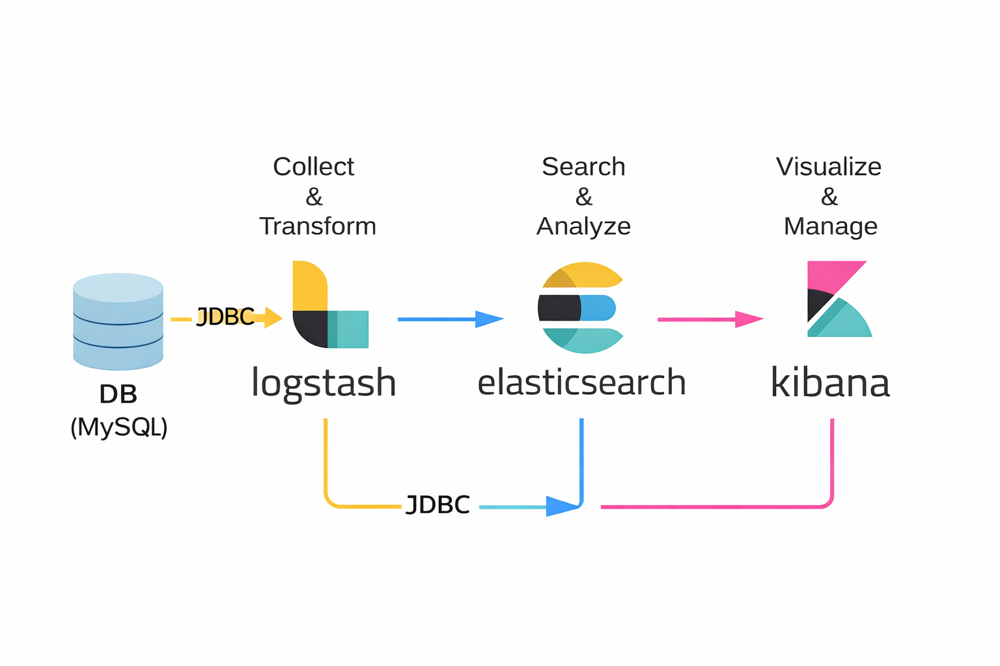
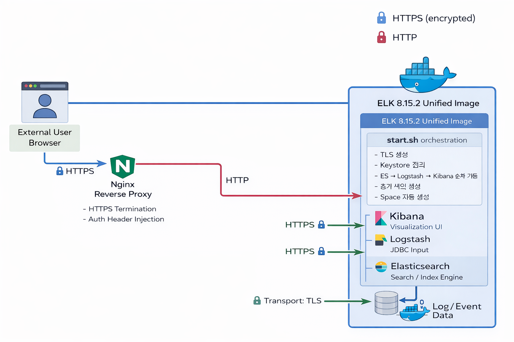
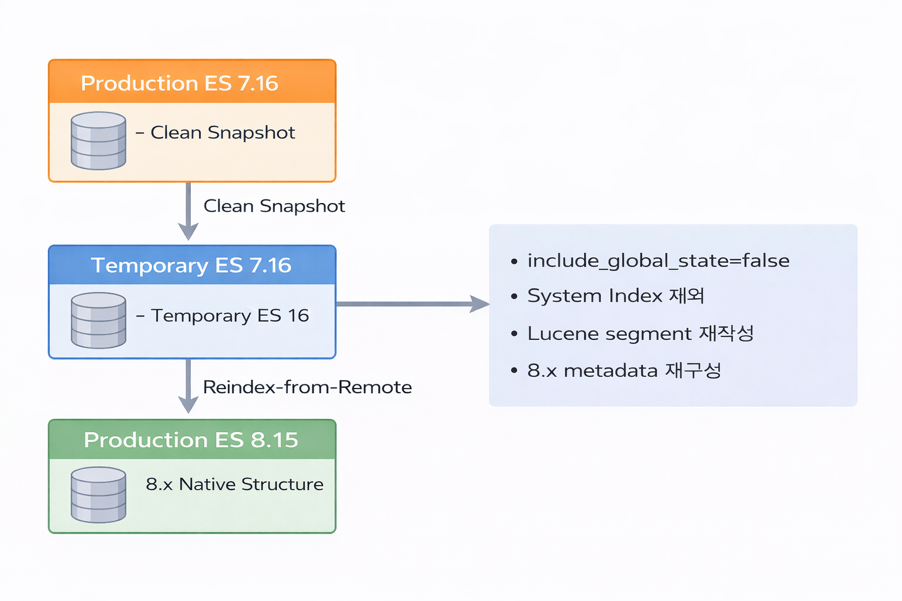

# ELK Docker 기반 보안 및 운영 자동화

## 1. 프로젝트 개요

- **프로젝트명**: ELK Docker 기반 보안 및 운영 자동화
- **프로젝트 소속**: ApptestAI
- **프로젝트 기간**: 2025.12 ~ 2026.02
- **프로젝트 인원**: 1명

### 프로젝트 배경

ELK(Stack)는 Elasticsearch, Logstash, Kibana로 구성된 로그 분석 플랫폼으로,
데이터 수집(Logstash) → 저장·검색(Elasticsearch) → 시각화(Kibana) 구조를 가진다.

본 시스템은 SaaS 서비스의 로그 수집·분석을 담당하는 핵심 인프라였으나,
운영 과정에서 다음과 같은 문제가 존재하였다.

- Elasticsearch 7.x 기반 노후 버전 사용
- TLS 및 인증 정책이 부분 적용된 상태
- 환경별 설정 혼재로 인한 운영 복잡도 증가
- 수동 배포 및 수동 초기 설정

이에 따라 ELK 8.x 기준 보안 정책을 반영하고,
Docker 기반 표준 이미지 구조로 재설계하여
운영 자동화와 보안 강화를 동시에 달성하는 것을 목표로 프로젝트를 수행하였다.

### ELK 기본 구조 개요

---

## 2. 시스템 아키텍처

본 시스템은 Elasticsearch · Logstash · Kibana를
**단일 Docker 이미지**로 구성하고,
컨테이너 기동 시 `start.sh`를 통해 모든 초기화 및 설정을 자동 수행하는 구조로 설계되었다.

### 설계 의사결정 (Architecture Decision Record)

#### 단일 Docker 이미지 구조 채택

일반적으로 ELK는 각 컴포넌트를 분리하여 운영하는 것이 일반적이나,
본 프로젝트에서는 단일 이미지 구조를 채택하였다.

**채택 이유:**

- SaaS 환경에서 빠른 배포 및 복구 필요
- 버전 불일치 리스크 제거 (ES / Logstash / Kibana 버전 통일)
- On-Premise 고객사 배포 단순화
- 운영 인력 최소 환경 고려

**트레이드오프:**

- 개별 컴포넌트 스케일링 불가
- 단일 장애 지점(Single Point of Failure) 존재

운영 환경 특성상 “확장성”보다 “배포 일관성과 단순성”을 우선하여 설계하였다.

---

## 3. 자동화 실행 구조

### 컨테이너 시작 시 자동 수행 프로세스

1. 환경 변수 확인 (`DEPLOY_ENV`)
2. 디렉토리 및 권한 정합성 확보
3. Keystore 정리
4. TLS 인증서 자동 생성
5. Elasticsearch 기동 및 상태 대기
6. 초기 인덱스 생성
7. Logstash 기동
8. Kibana 비밀번호 자동 발급
9. Kibana 기동
10. Space 및 Dashboard 자동 생성

---

## 4. 기술적 문제 및 해결

### 문제 1. ELK 8.x Root 실행 제한

ELK 8.x에서는 root 권한 실행이 제한되며,
컨테이너 환경과 충돌이 발생하였다.

#### 해결

- 각 서비스 전용 유저 활용 (`elasticsearch`, `kibana`, `logstash`)
- `su -s /bin/bash` 기반 권한 분리 실행
- 디렉토리 권한 자동 설정

---

### 문제 2. 7.x Data Volume 재사용에 따른 8.x 기동 실패

Elasticsearch 7.16.3의 `path.data` 디렉토리를  
8.15 컨테이너에 그대로 마운트하여 기동을 시도하였으나  
노드 시작 단계에서 실패하였다.

로그에는 다음과 같은 오류가 발생하였다.

- `incompatible index version`
- `node metadata version mismatch`

Elasticsearch는 메이저 버전(7 → 8) 간 내부 저장 구조가 변경되며,

- Lucene major version 변경
- Node metadata 포맷 변경
- System index 및 cluster metadata 구조 변경

이로 인해 7.x에서 생성된 data 디렉토리는  
8.x에서 직접 재사용할 수 없다.

기존 7.x 데이터가 남아 있는 상태에서 8.x 노드를 기동하면  
버전 충돌로 인해 Elasticsearch가 시작을 차단한다.

#### 해결 전략

7.x data volume을 직접 재사용하지 않고,  
Snapshot + Reindex 기반 마이그레이션 전략을 적용하였다.

Reindex 방식을 선택한 이유는
메이저 버전 간 Lucene 세그먼트 포맷 차이로 인해
Snapshot Restore만으로는 내부 구조 정합성을 보장할 수 없었기 때문이다.
Snapshot은 운영 데이터 보호 및 논리 복구 용도로 활용하고
실제 8.x 마이그레이션은 Reindex를 통해 내부 구조를 재구성했다.

#### 적용 절차

1. 운영 중인 Elasticsearch 7.16에서 Clean Snapshot 생성  
2. 7.16 임시 컨테이너에 Snapshot Restore
3. Elasticsearch 8.15에서 Reindex-from-Remote 수행

---

### 문제 3. TLS 및 보안 정책 미적용

기존 시스템은 HTTP/Transport 통신이 평문으로 동작.

#### 해결

- Root CA 생성
- HTTP / Transport 인증서 자동 생성
- PKCS12 변환 자동화
- Kibana/Logstash 인증서 자동 배포

컨테이너 기동 시 TLS 설정이 자동 적용되도록 구성하였다.

---

### 문제 4. Keystore 비밀번호 잔재 문제

빌드 시 생성된 keystore secure_password 값이 남아
TLS 설정과 충돌 발생.

#### 해결

- 컨테이너 시작 시 keystore 키 자동 탐색 및 제거
- 정합성 확보 후 Elasticsearch 기동

---

## 5. 운영 안정성 확보 전략

본 프로젝트는 단순 업그레이드가 아닌,
운영 리스크를 최소화하는 구조 설계를 목표로 하였다.

### 적용 전략

- Snapshot 기반 백업 체계 확보
- Idempotent 초기화 설계 (플래그 파일 기반 중복 방지)
- TLS 재생성 시 기존 인증서 유지 전략
- Keystore 자동 정리 로직 구현
- 환경 변수 기반 설정 자동 분기
- 버전 고정 (8.15.2)으로 예측 가능한 배포 확보

---

## 6. 개선 전 / 개선 후 비교

| 항목 | 개선 전 | 개선 후 |
|------|---------|---------|
| ELK 버전 | 7.x 혼재 | 8.15.2 통일 |
| 보안 | 부분 적용 | TLS 전면 적용 |
| 인증서 | 수동 생성 | 자동 생성 |
| 배포 방식 | 수동 | 컨테이너 자동화 |
| 인덱스 생성 | 수동 | 자동 |
| Dashboard 설정 | 수동 | 자동 임포트 |
| 환경 관리 | 혼재 | ENV 기반 분리 |

---

## 7. 결과 및 성과

### 보안 강화
- ELK 8.x 기준 보안 정책 준수
- TLS 통신 적용
- 인증 자동화

### 운영 효율성 향상
- 초기 세팅 시간: 수 시간 → 수 분 단축
- 환경별 설정 자동 분기
- 수동 작업 제거

### 정량적 성과
- 3개 환경(Service / Stage / On-Premise) 지원
- 6개 고객사 Space 자동 생성
- 모든 컴포넌트 8.15.2 통일

---

## 8. 프로젝트 의의

본 프로젝트는 단순 ELK 업그레이드가 아니라,
메이저 버전 마이그레이션 전략 수립,
보안 정책 표준화,
운영 자동화 체계 구축까지 수행한
플랫폼 재설계 프로젝트이다.

이를 통해 로그 분석 인프라를
운영 중심 구조에서 플랫폼 중심 구조로 전환하였다.
