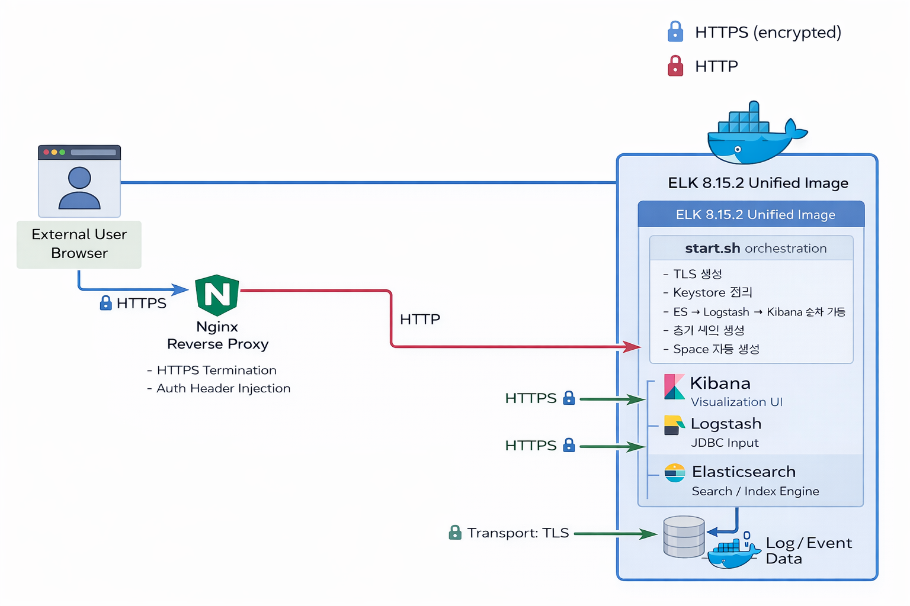
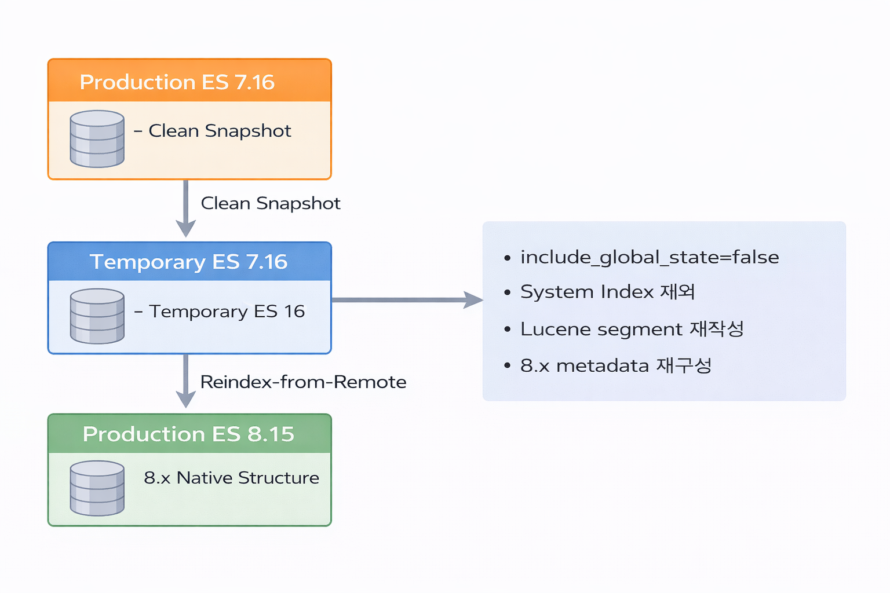

# ELK Docker 기반 보안 및 운영 자동화

## 1. 프로젝트 개요

- **프로젝트명**: ELK Docker 기반 보안 및 운영 자동화
- **프로젝트 소속**: ApptestAI
- **프로젝트 기간**: 2025.12 ~ 2026.02
- **프로젝트 인원**: 1명

### 프로젝트 목표
ELK(Stack)는 Elasticsearch, Logstash, Kibana로 구성된 로그 분석 플랫폼으로,       
서비스 로그 수집·저장·검색·시각화를 담당하는 핵심 인프라이다.      

기존 ELK 운영 환경은 Elasticsearch 7.x 기반으로 구축되어 있었으며,      
보안 정책 적용 범위가 제한적이고 환경별 설정 차이로 인해 운영 일관성이 부족한 상태였다.      

또한 인증서 설정, 인덱스 생성, Dashboard 구성 등 초기 구축 과정이 수동으로 수행되어        
배포 및 유지보수 효율성이 낮았으며, 버전 업그레이드와 장애 대응 과정에서도 운영 부담이 증가하고 있었다.

본 프로젝트는 Elasticsearch 8.x 기반 보안 정책을 적용하고,       
Elasticsearch · Logstash · Kibana를 단일 Docker 환경으로 통합하여        
배포 및 초기화 과정을 자동화함으로써 운영 효율성, 보안성, 환경 재현성을 향상시키는 것을 목표로 하였다.

### 기술 선정 배경
기존 ELK 운영 환경은 Elasticsearch, Logstash, Kibana가 각각 별도의 프로세스로 운영되고 있었으며,        
서버별 설정 차이와 수동 구성 요소가 많아 환경 재현성과 운영 일관성이 낮은 상태였다.

또한 인증서 설정, 인덱스 생성, Dashboard 구성 등의 초기 작업이 수동으로 수행되어         
배포 및 유지보수 비용이 증가하고 있었으며, 버전 업그레이드 및 장애 대응 과정에서도 운영 복잡도가 높았다.

이에 따라 기본 보안 기능(TLS, Authentication)이 강화된 Elasticsearch 8.x를 도입하여         
보안 정책을 표준화하고 운영 안정성을 강화하였다.        

아울러 기존 프로세스 기반 운영 방식을 Docker 기반 환경으로 전환하여         
Elasticsearch · Logstash · Kibana를 단일 이미지로 통합 구성하였다.         
이를 통해 버전 관리 일관성을 확보하고 환경별 설정 차이를 최소화하여 배포 재현성과 운영 효율성을 향상시켰다.

특히 SaaS 및 On-Premise 환경에서 동일한 방식으로 배포할 수 있도록 컨테이너 기동 시        
인증서 생성, 보안 설정, 인덱스 생성, Dashboard 구성 등의 초기화 작업이 자동 수행되도록 설계하였다.

Elasticsearch 7.x → 8.x 업그레이드 과정에서는 기존 데이터 볼륨 재사용 시 발생하는 Metadata 충돌 문제를 확인하였으며,        
Snapshot + Reindex 기반 마이그레이션 전략을 적용하여 데이터 정합성과 서비스 안정성을 확보하였다.

---

## 2. 시스템 아키텍처
컨테이너 기동 시 보안 설정 및 초기화 작업이 자동 수행되는 ELK 통합 환경을 구축하였다.

---

## 3. 담당역할
### ELK 환경 설계 및 구축
- Elasticsearch 8.x 기반 ELK 아키텍처 설계 및 구축
- Elasticsearch · Logstash · Kibana 단일 Docker 이미지 환경 구성
- Dockerfile 및 운영 환경 구축

### 배포 및 초기화 자동화
- 컨테이너 기동 시 초기 설정 자동화 프로세스 설계
- Elasticsearch Index 및 Template 생성 자동화
- Kibana Dashboard 및 Index Pattern 자동 구성 기능 구현

### 보안 정책 적용
- TLS 기반 암호화 통신 환경 구성
- Elasticsearch Security(Authentication / Authorization) 설정 적용
- 인증서 생성 및 배포 프로세스 자동화

### 데이터 마이그레이션
- Elasticsearch 7.x → 8.x 버전 업그레이드 수행
- Snapshot 기반 데이터 백업 및 복구 환경 구축
- Reindex 기반 데이터 마이그레이션 수행
- Metadata 충돌 이슈 분석 및 해결

### 운영 환경 표준화
- 환경별 설정 통합 및 배포 프로세스 표준화
- 운영 자동화를 통한 환경 재현성 확보
- 유지보수 및 운영 효율성 개선

---

## 4. 기술적 문제 및 해결

### 문제 1. ELK 8.x Root 실행 제한
운영 환경 특성상 Docker 컨테이너를 root 권한으로 실행해야 했으나,           
ELK 8.x는 보안 정책상 Elasticsearch, Kibana, Logstash 프로세스의 root 실행을 제한하고 있었다.

이로 인해 컨테이너 내부에서 ELK 서비스가 root 권한으로 기동되면서           
서비스 시작이 실패하는 문제가 발생하였다.

#### 해결
- 컨테이너는 root 권한으로 실행하되, 각 서비스는 비권한 사용자로 실행되도록 구성
- `su -s /bin/bash` 기반 프로세스 권한 분리 적용
- 데이터 디렉토리 및 설정 파일 권한 자동 설정 로직 구현
- 컨테이너 시작 시 권한 검증 및 초기화 작업 자동 수행

---

### 문제 2. 7.x Data Volume 재사용에 따른 8.x 기동 실패

Elasticsearch 7.16.3의 `path.data` 디렉토리를  
8.15 컨테이너에 그대로 마운트하여 기동을 시도하였으나  
노드 시작 단계에서 실패하였다.

로그에는 다음과 같은 오류가 발생하였다.

- `incompatible index version`
- `node metadata version mismatch`

Elasticsearch는 메이저 버전(7 → 8) 간 내부 저장 구조가 변경되며,

- Lucene major version 변경
- Node metadata 포맷 변경
- System index 및 cluster metadata 구조 변경

이로 인해 7.x에서 생성된 data 디렉토리는  
8.x에서 직접 재사용할 수 없다.

기존 7.x 데이터가 남아 있는 상태에서 8.x 노드를 기동하면  
버전 충돌로 인해 Elasticsearch가 시작을 차단한다.

#### 해결 전략

7.x data volume을 직접 재사용하지 않고,  
Snapshot + Reindex 기반 마이그레이션 전략을 적용하였다.

Reindex 방식을 선택한 이유는
메이저 버전 간 Lucene 세그먼트 포맷 차이로 인해
Snapshot Restore만으로는 내부 구조 정합성을 보장할 수 없었기 때문이다.
Snapshot은 운영 데이터 보호 및 논리 복구 용도로 활용하고
실제 8.x 마이그레이션은 Reindex를 통해 내부 구조를 재구성했다.

#### 적용 절차

1. 운영 중인 Elasticsearch 7.16에서 Clean Snapshot 생성  
2. 7.16 임시 컨테이너에 Snapshot Restore
3. Elasticsearch 8.15에서 Reindex-from-Remote 수행

---

### 문제 3. TLS 및 보안 정책 미적용
기존 ELK 환경은 TLS 및 인증 정책이 일관되게 적용되지 않아,       
환경별 보안 설정 편차가 발생할 수 있었으며 초기 구축 시 수동 설정 작업이 필요하였다.

또한 Elasticsearch 8.x 보안 기능을 활용하기 위해서는      
인증서 생성 및 배포 과정을 표준화할 필요가 있었다.

#### 해결
- Root CA(Certificate Authority) 자동 생성
- Elasticsearch HTTP / Transport Layer 인증서 자동 발급
- PKCS#12 형식 변환 자동화
- Kibana 및 Logstash 인증서 자동 배포
- 컨테이너 기동 시 TLS 설정 및 보안 구성 자동 적용
- Elasticsearch Security(Authentication) 설정 자동화

---

### 문제 4. Elasticsearch Keystore 보안 설정 충돌

Elasticsearch 재배포 및 버전 업그레이드 과정에서         
기존 Keystore에 저장된 `secure_password` 설정이 유지되면서,        
새롭게 생성된 TLS 인증서 정보와 불일치하는 문제가 발생하였다.        

이로 인해 Elasticsearch 기동 시 SSL 설정 검증 단계에서 오류가 발생하여        
서비스가 정상적으로 시작되지 않았다.        

#### 해결
- 컨테이너 시작 시 Elasticsearch Keystore 상태 점검
- 기존 `secure_password` 관련 설정 자동 탐색 및 제거
- TLS 인증서 설정과 Keystore 정보 정합성 검증
- 검증 완료 후 Elasticsearch 기동하도록 초기화 프로세스 구성

---

## 5. 결과 및 성과

### 보안 강화
- Elasticsearch 8.x 보안 정책 적용
- TLS 기반 암호화 통신 환경 구축
- 인증서 생성 및 배포 자동화
- ELK 컴포넌트 간 보안 설정 표준화

### 운영 효율성 향상
- 초기 구축 및 설정 시간 단축 (수 시간 → 수 분)
- 컨테이너 기동만으로 환경 구성 자동화
- 인증서 생성, 인덱스 생성, Dashboard 구성 자동화
- 수동 설정 작업 제거 및 운영 절차 표준화

### 안정성 확보
- Elasticsearch 7.x → 8.x 마이그레이션 완료
- Snapshot + Reindex 기반 데이터 이전 수행
- Keystore 및 TLS 설정 충돌 문제 해결
- 환경 재현성 확보를 통한 배포 안정성 향상

### 정량적 성과
- Service / Stage / On-Premise 등 3개 운영 환경 지원
- 고객사별 Kibana Space 6개 자동 생성
- Elasticsearch · Logstash · Kibana 버전 8.15.2 통일
- 단일 Docker 이미지 기반 배포 체계 구축
---

## 6. 사용기술
- **Platform**
  - Elasticsearch
  - Logstash
  - Kibana

- **Container**
  - Docker
  - Dockerfile

- **Security**
  - TLS / SSL
  - Elasticsearch Security
  - Authentication / Authorization

- **Automation**
  - Shell Script

- **Data Migration**
  - Snapshot
  - Reindex API

- **Operating System**
  - Linux (Ubuntu)

- **Monitoring & Logging**
  - ELK Stack
  - Index Template
  - Kibana Dashboard

---

## 7. 프로젝트 의의           
본 프로젝트는 단순한 ELK 버전 업그레이드가 아닌,           
메이저 버전 마이그레이션 전략 수립, 보안 정책 표준화,           
배포 및 초기화 자동화 체계 구축까지 수행한           
로그 분석 플랫폼 개선 프로젝트이다.

기존의 수동 구성 및 환경 의존적인 운영 방식을 개선하고,           
Docker 기반 표준 환경과 자동화된 배포 프로세스를 구축하여           
운영 효율성, 보안성, 환경 재현성을 향상시켰다.

또한 Elasticsearch 8.x 기반 보안 정책 적용과           
Snapshot + Reindex 마이그레이션 전략을 통해           
안정적인 데이터 이전 및 운영 안정성을 확보하였다.

